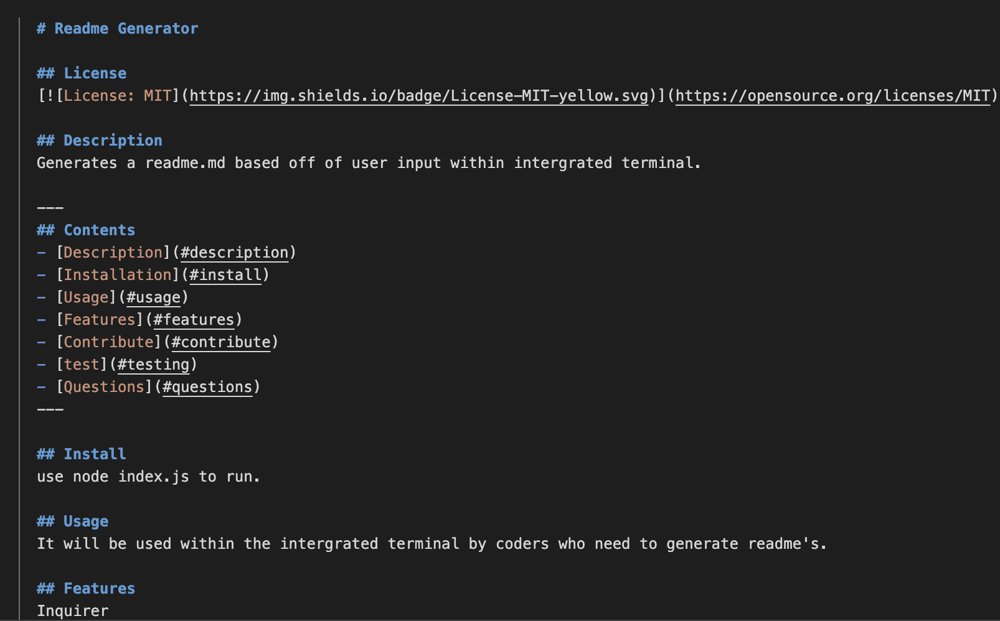

## README Generator

## Description
The goal of this assignment was to create a high quality README generator. It's important to have a high quality readme for any project on GitHub. A readme allows the user to know what the app is for, it's uses, how to install it & much more. 

## Installation
Please install the [Inquirer package](https://www.npmjs.com/package/inquirer). 

The application will be invoked by using the following command:

```bash
node index.js
```
Please use this version of inquirer 
```bash
npm install inquirer@8.2.0 --save
```

## Usage
Example of Readme: 


<br />
<br />

Example of Terminal Inputs:


## Video
Link to Walkthrough: https://drive.google.com/file/d/1XmCaju0N8F28Ibf5AcjgoKBGI-eN-K4e/view 

## Credits
* UofM Bootcamp

## Features

* Inquirer
* Node.js
